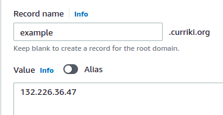
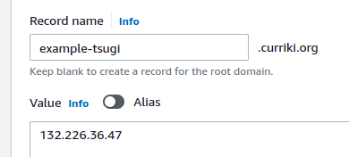
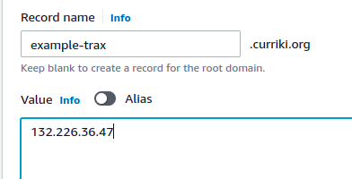

Active Learning Studio Setup Instructions

# Introduction
CurrikiStudio enables you to create interactive learning content and publish them anywhere like Google Classroom, LMSs etc.
This repo makes it easy to install currikistudio as docker containers in cloud VM (AWS, Azure, GCP, Linode etc)

# Components
## Applications
Following applications are the part of CurrikiStudio

1. React Frontend application
2. Backend API
3. Tsugi for LTI
4. Trax LRS

## Databases
1. Postgres (For API, For LRS)
1. MySQL (For Tsugi)

## Minimum Requirements
- One Linux VMs (8GB RAM 4 VCPUs, Storage 80GB)
- Ubuntu, Amaozon Linux, Oracle Linux (Windows not supported)

## Pre-Requisites
Docker version 19 or above

  
## Docker Installation (For Ubuntu 18.04, 20.04)
  
 Install docker

Login to the terminal and switch to the root user.

    sudo apt-get update -y
    sudo apt-get install apt-transport-https ca-certificates curl gnupg -y
    curl -fsSL https://download.docker.com/linux/ubuntu/gpg | sudo gpg --dearmor -o /usr/share/keyrings/docker-archive-keyring.gpg
    sudo apt install docker.io -y
    sudo systemctl restart docker
    sudo systemctl enable docker
    sudo curl -L https://github.com/docker/compose/releases/download/1.28.4/docker-compose-$(uname -s)-$(uname -m) -o /usr/local/bin/docker-compose
    sudo chmod +x /usr/local/bin/docker-compose
    sudo ln -s /usr/local/bin/docker-compose /usr/bin/docker-compose

## Infrastructure

Before installing the application, we need DNS entries. 

For Lets Encrypt to work, add DNS records:

Copy public IP of the VM and put inside the DNS records like this.

Say for example, if the public IP of your VM is 132.226.36.47, and your domain (where you want to install studio) is example.curriki.org

You must create three A records in your DNS provider like below:

### AWS Route 53 example

Login to the AWS Management Console and Search for Route53 Service.
Click on the Hosted Zones and then select the desired Domain Name to add the “A entry”.

Click on the “Create Record” Button 

From the below Screenshot, enter the A record name, Value (Public IP of the VM) and leave the other values to the default.

Main Record

Tsugi Record

Trax Record

Click on the Create Record Button to finish creating the A Record for DNS.

Note that, we should create three A Records in Route 53 for currikistudio (main, site tsugi, and trax)

Example:

    example.curriki.org             132.226.36.47
    example-tsugi.curriki.org       132.226.36.47
    example-trax.curriki.org        132.226.36.47

This step is necessary to generate lets encrypt certificate which will be discussed later in this section

## Studio Installation

Go to the root level of the VM and clone the this repo:

> git clone https://github.com/ActiveLearningStudio/StudioSingleServer curriki

    cd curriki
    cp .env.example .env
    cp api/.env.example api/.env
    cp client/.env.example client/.env
    cp client/.env.example client/.env.local
    cp tsugi/config.example.php tsugi/config.php
    cp tsugi/mod/curriki/config.example.php tsugi/mod/curriki/config.php

Change the content of ./.env like database ports / passwords according to your own choice

Example:

    TAG=latest
    DB_HOST=currikiprod1-postgres
    DB_PORT=5432
    DB_DATABASE=dbstudio
    DB_USERNAME=root
    DB_PASSWORD=password
    MYSQL_DATABASE=dbstudio
    MYSQL_USER=curriki
    MYSQL_PASSWORD=password
    MYSQL_ROOT_PASSWORD=password
    MYSQL_LOCAL_PORT=3306
  

Create folders for database persistent storage as below

    sudo mkdir -p /mnt/DBData/currikiprod1-mysqldata
    sudo mkdir -p /mnt/DBData/currikiprod1-postgresdata
    sudo mkdir -p /mnt/DBData/pgadmin1-data
    

Replace these texts in the files below:

1. substitute-terraform-domain.com => example.curriki.org
2. substitute-terraform-tsugi-domain.com => example-tsugi.curriki.org
3. substitute-terraform-trax-domain.com => example-trax.curriki.org
4. substitute-postgres-db-host => currikiprod1-postgres
5. substitute-postgres-port => 5432
6. substitute-postgres-db => dbcurriki
7. substitute-postgres-user => root
8. substitute-postgres-password => password
9. substitute-mysql-db-host => currikiprod1-mysql
10. substitute-postgres-db-host => currikiprod1-postgres
11. substitute-postgres-port => 5432
12. substitute-lrs-db-database => trax
13. substitute-postgres-user => root
14. substitute-postgres-password => password
15. substitute-mysql-db-port => 3306
16. substitute-tsugi-db-dbname=> tsugi
17. substitute-mysql-db-user => curriki
18. substitute-mysql-db-password => password

Files list to replace
1. ./init-lets-encrypt.sh
2. ./data/nginx/prod-conf/app.conf
3. ./data/nginx/certbot-conf/app.conf
4. ./curriki/api/.env
5. ./curriki/client/.env
6. ./curriki/client/.env.local

1. Now, run the below command 

docker swarm init

set -a 

docker-compose up

To test the above db connection, ssh into the application server

`	`ssh root@<public ip of the vm>

and then run

`	`docker ps

`	`docker exec -it currikiprod1-postgres

and then connect to the currikdb to test the connect and created tables

`	`psql -U root -d currikidb

`	`\dt – to visualize all tables

`	`\l to check the list of databased currently available in postgresdb

`	`set -a

`	`source .env

`	`env docker stack deploy -c docker-compose.yml currikistack

`	`docker service ls

`	 `

`	`To test the database again for tusgi,

`		`docker exec -it <<enter docker service name>>

`	`and then connect to the currikdb to test the connect and created tables

`		`psql -U root -d currikidb

`		`\l to check the list of databased currently available in postgresdb

1. Let us install “currikiprod1-mysql” in the yaml file and let us do it step by step:

`	`Now, create the following environment variables for postgresdb which is defined in the yaml file:

`	`MYSQL\_USER=<<pass db username>>

MYSQL\_PASSWORD=<<pass secured value>>

MYSQL\_DATABASE=<<pass db name>>

MYSQL\_ROOT\_PASSWORD=<<pass the root password>>

`	`MYSQL\_LOCA\_PORT}=3307

Once setting up the parameter, again repeat the following steps:

`	`set -a

`	`source .env

`	`env docker stack deploy -c docker-compose.yml currikistack

Before setting up every environment, let us first run the stacks.

Navigate to client folder under curriki, and pass “ls” command.

`	`

In every folder, there will be .env.example as shown in the above screenshot. Rename the files as follows:

`	`cp .env.example .env.local

`	`cp .env.example .env

`	`

Do the foll0wing steps for api, trax-lrs, and tsugi

Navigate to api folder under curriki, and pass “ls” command.

`	`cp .env.example .env

Navigate to trax-lrs folder under curriki, and pass “ls” command.

`	`cp .env.example .env

Navigate to tsugi folder under curriki, and pass “ls” command and do the following steps.

`	`rm tsugi-main-config.example.php

`	`mv tsugi-main-config.example1.php tsugi-main-config.example.php

`	`ls 

`	`cd mod/curriki/

`	`ls

`	`cp tsugi-curriki-config.php config.php

cp .env.example .env

Once all the above is done, navigate back to the curriki root directory.

Open docker-compose.yml file and go to the “currikiprod-api” to set the environment variable for “TAG”

`	`vim .env

`	`and add the value for TAG

`		`TAG=develop

Then, navigate to the api folder in curriki, and do the following:

`	`du -hs storage

`	`rm -rf storage

`	`cp storagetoclone/ storage

Remember we have created the A Entry in AWS Route53. Now that needs to configured in the application.

Now, let us run again the following steps:

`	`set -a

`	`source .env

Once it is done. Your application will be deployed on the DNS provided like example.currikistudio.org

  
  
  
  
  
  
  
  
  
  
  
